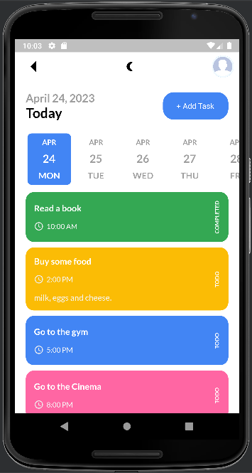
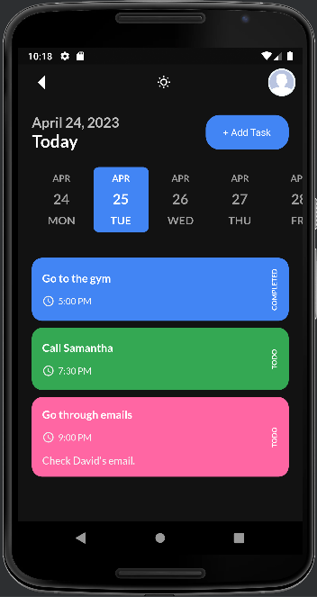
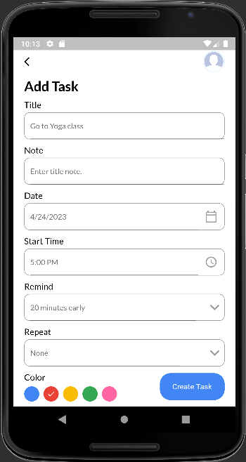
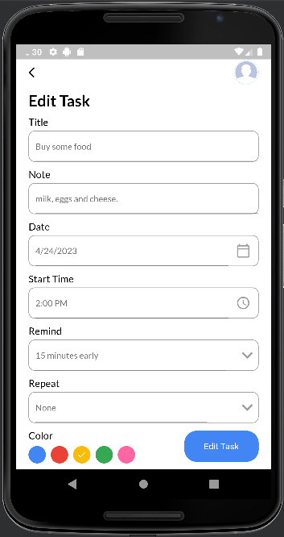
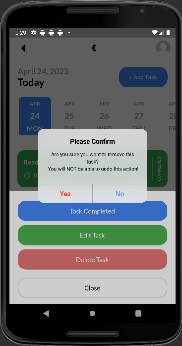
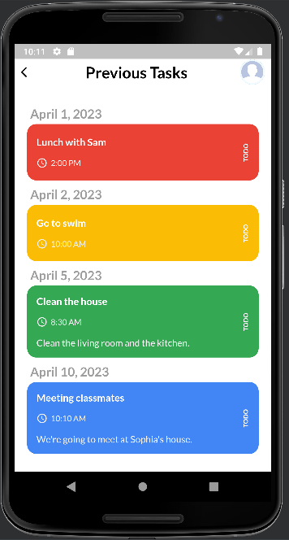

# todo_app

A new Flutter project.

## Getting Started

This project is a starting point for a Flutter application.

A few resources to get you started if this is your first Flutter project:

- [Lab: Write your first Flutter app](https://docs.flutter.dev/get-started/codelab)
- [Cookbook: Useful Flutter samples](https://docs.flutter.dev/cookbook)

For help getting started with Flutter development, view the
[online documentation](https://docs.flutter.dev/), which offers tutorials,
samples, guidance on mobile development, and a full API reference.

## About: 
Todo application made with:
- [Flutter](https://flutter.dev/) (Flutter is an open-source UI software development kit created by Google.)
- [Get](https://pub.dev/packages/get) (Open screens/snackbars/dialogs without context, manage states and inject dependencies easily with GetX.)
- [Sqflite](https://pub.dev/packages/sqflite) (Flutter plugin for SQLite, a self-contained, high-reliability, embedded, SQL database engine.)

## The App handles: 
- Adding a new task.
- Editing a task.
- Deleting a task.
- Mark task as completed/incomplete.
- Show previous tasks.
- Change theme (dark/light mode).
- Reminder with notification.

## Screenshots

| Home Page | Activate Dark theme | Dark theme | Add task |
| ------------- | ------------- | ------------- | ------------- |
|  |  |  |  |

| Edit/Delete/Completed | Edit task | Delete task | Previous tasks |
| ------------- | ------------- | ------------- | ------------- |
|  |  |  |  |
